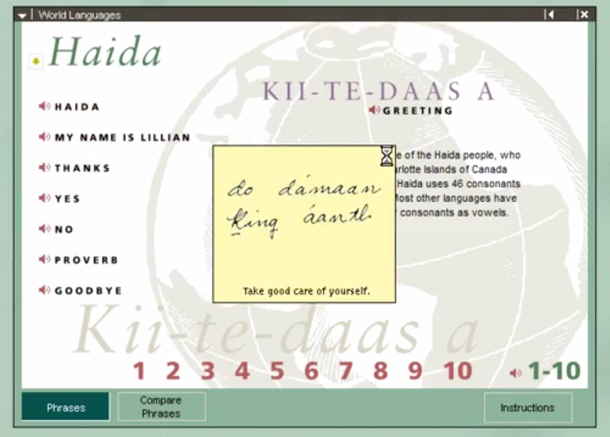

## Encarta9x (95,97,98) interactive languages online port

## [Check it out here](https://tomeko.github.io/encarta9x-languages/)

### What is this?
[Encarta](https://en.wikipedia.org/wiki/Encarta) was a Microsoft digital encyclopedia that you would access by CD-ROM back in the day. Think of it like ancient Wikipedia. One part of the 97/98 releases was the interactive languages section, where there were a bunch of audio snippets you could play from various languages. Some of the voice actors were quite memorable.

By today's standards it's nothing extraordinary, but if you used it at the time it's a major nostalgia trip (at least for me).

This is simply a recreation of the interactive language section with all original audio. Below is a screenshot of the original.

Original Encarta world languages interface

### Some of my favorite voice actors (by language) include:
  - Haidi
  - Quechua
  - Yiddish

### This currently isn't a 1:1 UI replica, but if any fluent in CSS/etc want to PR please do
